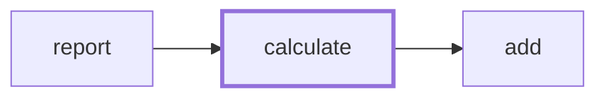

# Tool reference

Every tool returns compact `path:line` text designed for token economy. Outputs below are
real (trimmed) results from indexing [gson](https://github.com/google/gson),
[ripgrep](https://github.com/BurntSushi/ripgrep), [django](https://github.com/django/django),
and [godot-demo-projects](https://github.com/godotengine/godot-demo-projects).

Symbols carry stable ids (`#N`) usable wherever a tool accepts `symbol_id`. Provenance is
explicit everywhere: `(lsp)` / `[lsp 1.00]` means a language server answered; `(resolved 0.85)`
/ `[index 0.70]` is heuristic structural resolution with its confidence.

## Navigation & symbols

### `project_overview`
First call of a session — languages, sizes, engines, freshness.
```
workspace: D:\dev\godot-demos
index: ready
totals: 492 files, 4719 symbols, 216 imports, 47205 occurrences, 1136 graph edges
languages:
  gdscript: 456 files, 4280 symbols
engine assets:
  godot: 138 project, 136 resource, 392 scene
```

### `search_symbols` — `{query, kind?, lang?, path_prefix?, exported_only?}`
Name/doc search (FTS + fuzzy). `search_symbols {query: "Player", lang: "gdscript", kind: "class"}`:
```
class Player — class_name Player  (2d/physics_platformer/player/player.gd:1) #318
class Player — class_name Player  (2d/platformer/player/player.gd:1) #802
```

### `semantic_search` — `{query, k?, lang?}`
Describe *behavior* in plain language; hybrid embedding+keyword ranking, fully local.
`semantic_search {query: "where are uploaded files validated for malicious names"}` on django:
```
[vec cos=0.73] function validate_file_name — def validate_file_name(name, allow_relative_path=False)  (django/core/files/utils.py:7) #7588
[vec cos=0.67] method Storage.get_valid_name — def get_valid_name(self, name):  (django/core/files/storage/base.py:60) #7451
```
First-ever call downloads the model (~150 MB, one-time); until coverage completes results are
keyword-weighted and say so.

### `get_file_outline` — `{path, include_docs?}`
Read a file's structure without reading the file.
```
src/math.ts (typescript, 12 symbols)
5: function add(a: number, b: number): number #3
20: class Circle #7
  26: method area(): number #9
```

### `get_symbol_info` — `{symbol_id | path+line | name, include_source?}`
Signature, docs, container, LSP hover when available, optional bounded source snippet.

### `go_to_definition` — `{path, line, col}`
LSP-exact with index fallback:
```
definition of JsonReader:
gson/src/main/java/com/google/gson/stream/JsonReader.java:211:13 (lsp)
```

### `ast_query` — `{pattern, lang, path_prefix?}`
Raw tree-sitter S-expressions for structural searches regex can't express:
`(call_expression function: (identifier) @fn (#eq? @fn "eval"))`.

## Flow

### `find_references` — `{symbol_id | path+line | name, role?}`
LSP-first, provenance-tagged, resolved usages before name-match candidates.

### `call_hierarchy` — `{…, direction: in|out, depth<=3}`
```
callers of constructor Gson.Gson (…/Gson.java:247) #214
  method create() : Gson (…/GsonBuilder.java:922) #325 [lsp 1.00]
    method setUp() : void (metrics/src/…/SerializationBenchmark.java:42) #4879 [lsp 1.00]
```

### `type_hierarchy` — `{…, direction: super|sub}`
Extends/implements edges in either direction.

### `get_dependencies` — `{path, direction?: out|in}`
File import graph: what this file imports / who imports it.

### `trace_path` — `{from_name|from_id, to_name|to_id, max_depth?}`
Shortest call chain: *how does the request handler reach the DB layer?*
```
call path (2 hops):
function report (src/report.ts:12) -> function calculate (src/calc.ts:8) -> function add (src/math.ts:5)
```

### `generate_diagram` — `{kind: imports|calls|types|call_path, …}`
The graph tools rendered as Mermaid instead of text — the output is a ` ```mermaid ` fence ready to
paste into GitHub markdown, docs, or any Mermaid viewer. `imports` draws the workspace import graph
(file-level with directory subgraphs, or collapsed to directories via `granularity`; scope with
`path_prefix`); `calls` draws the call graph around one symbol (`direction: in|out|both`, `depth`);
`types` draws inheritance around one type; `call_path` draws the shortest call chain between two
symbols. Dotted arrows mark low-confidence structural edges (< 0.70).
````
call graph around function calculate (src/calculator.ts:4), arrows caller -> callee:


````

## Game engines

### `get_scene_structure` — `{path}`
Godot scene tree with scripts, instanced sub-scenes, and signal connections (handlers
resolved to symbols):
```
2d/pong/pong.tscn (godot scene, 21 nodes)
Pong (Node2D)
  Left (Area2D)  script=res://logic/paddle.gd
  Ball (Area2D)  script=res://logic/ball.gd
connections:
  area_entered: LeftWall -> LeftWall :: _on_wall_area_entered  (2d/pong/logic/wall.gd:3 #839)
```

### `find_asset_references` — `{target}`
Reverse lookup across assets — a script path, `res://` path, Unity-mapped path (GUIDs resolved
via `.meta`), handler method, or Unreal module name:
```
2d/pong/pong.tscn (godot scene)  script: res://logic/paddle.gd  — Pong/Left
Assets/Player.prefab (unity prefab)  script: Assets/PlayerController.cs (guid aaaa1111…)  — Player
```

### `search_reflection` — `{specifier}`
Engine reflection markers: `UPROPERTY`, `BlueprintCallable`, `[SerializeField]`, `@export`, `signal`.
Unreal macros (multi-line specifiers included) are captured onto the annotated symbol at index
time, so answers come from the index with symbol ids:
```
Source/Game/MyActor.h:19  UFUNCTION(BlueprintCallable, Category = "Combat")  void Fire(); #212
2d/dodge_the_creeps/player.gd:5  [gdscript] variable speed: @export var speed = 400 #64
```

## Meta

### `index_status` / `reindex`
Index freshness, per-language LSP server state, embedding coverage, watcher health;
`reindex` forces a hash-checked re-scan.
